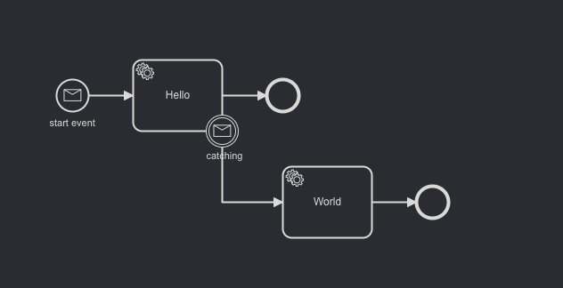

# Minimal Reproducer

## The issue

In a simple workflow:



The worker fail the job that it receives from Zeebe. From 0 to 126 retries everthing is fine. When we reach 127 retries, the job stays stuck in Zeebe workflow and we can't get back to the worker even after restarting zeebe_broker / worker.

## How to run

1. Install dependencies:
```bash
npm i
```
2. run latest Zeebe version 
```bash
docker/run
```
3. Deploy process, create one job and bind worker:
```bash
npm start
```

## Current behaviour

If message has not been correlated, it's a success. We use the `publishStartMessage` method but `publishMessage` has the same behaviour.

## Expected behaviour

If message has not been correlated, it should throw an exception because the message should be correlated at least to one bpmn.

## Version

- zeebe_broker: 0.18.0
- zeebe_node: 2.3.0