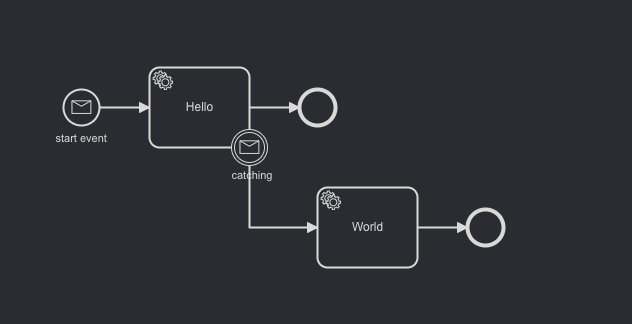

# Minimal Reproducer

## The issue

In a simple workflow:



The worker fail the job that it receives from Zeebe. From 0 to 126 retries everthing is fine. When we reach 127 retries, the job stays stuck in Zeebe workflow and we can't get back to the worker even after restarting zeebe_broker / worker.

## How to run

1. Install dependencies:
```bash
npm i
```
2. run latest Zeebe version 
```bash
docker/run
```
3. Deploy process, create one job and bind worker:
```bash
npm start
```

## Logs from worker

```
[ERROR]  (node:6579) UnhandledPromiseRejectionWarning: Error: 13 INTERNAL: Unexpected error occurred during the request processing
    at Object.exports.createStatusError (/Users/ualbe94/apps/zeebe-reproducer-1/node_modules/grpc/src/common.js:91:15)
    at Object.onReceiveStatus (/Users/ualbe94/apps/zeebe-reproducer-1/node_modules/grpc/src/client_interceptors.js:1204:28)
    at InterceptingListener._callNext (/Users/ualbe94/apps/zeebe-reproducer-1/node_modules/grpc/src/client_interceptors.js:568:42)
    at InterceptingListener.onReceiveStatus (/Users/ualbe94/apps/zeebe-reproducer-1/node_modules/grpc/src/client_interceptors.js:618:8)
    at callback (/Users/ualbe94/apps/zeebe-reproducer-1/node_modules/grpc/src/client_interceptors.js:845:24)
[[12:25:24.396]] [ERROR]  (node:6579) UnhandledPromiseRejectionWarning: Unhandled promise rejection. This error originated either by throwing inside of an async function without a catch block, or by rejecting a promise which was not handled with .catch(). (rejection id: 1)
[[12:25:24.396]] [ERROR]  (node:6579) [DEP0018] DeprecationWarning: Unhandled promise rejections are deprecated. In the future, promise rejections that are not handled will terminate the Node.js process with a non-zero exit code.
```

## Logs from Broker 

```
Caused by: java.lang.RuntimeException: Could not read property 'payload'
	at io.zeebe.msgpack.value.ObjectValue.read(ObjectValue.java:118) ~[zb-msgpack-value-0.15.1.jar:0.15.1]
	at io.zeebe.msgpack.UnpackedObject.wrap(UnpackedObject.java:39) ~[zb-msgpack-value-0.15.1.jar:0.15.1]
	at io.zeebe.msgpack.UnpackedObject.wrap(UnpackedObject.java:32) ~[zb-msgpack-value-0.15.1.jar:0.15.1]
	at io.zeebe.gateway.impl.broker.request.BrokerFailJobRequest.toResponseDto(BrokerFailJobRequest.java:46) ~[zeebe-gateway-0.15.1.jar:0.15.1]
	at io.zeebe.gateway.impl.broker.request.BrokerFailJobRequest.toResponseDto(BrokerFailJobRequest.java:23) ~[zeebe-gateway-0.15.1.jar:0.15.1]
	at io.zeebe.gateway.impl.broker.request.BrokerExecuteCommand.readResponse(BrokerExecuteCommand.java:106) ~[zeebe-gateway-0.15.1.jar:0.15.1]
	at io.zeebe.gateway.impl.broker.request.BrokerRequest.getResponse(BrokerRequest.java:81) ~[zeebe-gateway-0.15.1.jar:0.15.1]
	at io.zeebe.gateway.impl.broker.BrokerRequestManager.lambda$sendRequestInternal$6(BrokerRequestManager.java:189) ~[zeebe-gateway-0.15.1.jar:0.15.1]
	... 7 more
Caused by: java.lang.IllegalArgumentException: Expected document to be a root level object, but was 'INTEGER'
	at io.zeebe.msgpack.value.DocumentValue.wrap(DocumentValue.java:51) ~[zb-msgpack-value-0.15.1.jar:0.15.1]
	at io.zeebe.msgpack.value.BinaryValue.read(BinaryValue.java:86) ~[zb-msgpack-value-0.15.1.jar:0.15.1]
	at io.zeebe.msgpack.property.BaseProperty.read(BaseProperty.java:83) ~[zb-msgpack-value-0.15.1.jar:0.15.1]
	at io.zeebe.msgpack.value.ObjectValue.read(ObjectValue.java:116) ~[zb-msgpack-value-0.15.1.jar:0.15.1]
	at io.zeebe.msgpack.UnpackedObject.wrap(UnpackedObject.java:39) ~[zb-msgpack-value-0.15.1.jar:0.15.1]
	at io.zeebe.msgpack.UnpackedObject.wrap(UnpackedObject.java:32) ~[zb-msgpack-value-0.15.1.jar:0.15.1]
	at io.zeebe.gateway.impl.broker.request.BrokerFailJobRequest.toResponseDto(BrokerFailJobRequest.java:46) ~[zeebe-gateway-0.15.1.jar:0.15.1]
	at io.zeebe.gateway.impl.broker.request.BrokerFailJobRequest.toResponseDto(BrokerFailJobRequest.java:23) ~[zeebe-gateway-0.15.1.jar:0.15.1]
	at io.zeebe.gateway.impl.broker.request.BrokerExecuteCommand.readResponse(BrokerExecuteCommand.java:106) ~[zeebe-gateway-0.15.1.jar:0.15.1]
	at io.zeebe.gateway.impl.broker.request.BrokerRequest.getResponse(BrokerRequest.java:81) ~[zeebe-gateway-0.15.1.jar:0.15.1]
	at io.zeebe.gateway.impl.broker.BrokerRequestManager.lambda$sendRequestInternal$6(BrokerRequestManager.java:189) ~[zeebe-gateway-0.15.1.jar:0.15.1]
	... 7 more
17:25:24.305 [exporter] [172.18.0.3:26501-zb-actors-0] ERROR io.zeebe.util.actor - Actor failed in phase 'STARTED'. Continue with next job.
java.lang.RuntimeException: Could not deserialize object. Deserialization stuck at offset 289 of length 321
	at io.zeebe.msgpack.UnpackedObject.wrap(UnpackedObject.java:43) ~[zb-msgpack-value-0.15.1.jar:0.15.1]
	at io.zeebe.logstreams.impl.LoggedEventImpl.readValue(LoggedEventImpl.java:149) ~[zb-logstreams-0.15.1.jar:0.15.1]
	at io.zeebe.broker.exporter.stream.ExporterRecordMapper.ofJobRecord(ExporterRecordMapper.java:168) ~[zeebe-broker-core-0.15.1.jar:0.15.1]
	at io.zeebe.broker.exporter.stream.ExporterRecordMapper.newRecord(ExporterRecordMapper.java:150) ~[zeebe-broker-core-0.15.1.jar:0.15.1]
	at io.zeebe.broker.exporter.stream.ExporterRecordMapper.map(ExporterRecordMapper.java:134) ~[zeebe-broker-core-0.15.1.jar:0.15.1]
	at io.zeebe.broker.exporter.stream.ExporterStreamProcessor$RecordExporter.wrap(ExporterStreamProcessor.java:210) ~[zeebe-broker-core-0.15.1.jar:0.15.1]
	at io.zeebe.broker.exporter.stream.ExporterStreamProcessor.onEvent(ExporterStreamProcessor.java:87) ~[zeebe-broker-core-0.15.1.jar:0.15.1]
	at io.zeebe.logstreams.processor.StreamProcessorController.processEvent(StreamProcessorController.java:298) ~[zb-logstreams-0.15.1.jar:0.15.1]
	at io.zeebe.logstreams.processor.StreamProcessorController.readNextEvent(StreamProcessorController.java:287) ~[zb-logstreams-0.15.1.jar:0.15.1]
	at io.zeebe.util.sched.ActorJob.invoke(ActorJob.java:90) ~[zb-util-0.15.1.jar:0.15.1]
	at io.zeebe.util.sched.ActorJob.execute(ActorJob.java:53) [zb-util-0.15.1.jar:0.15.1]
	at io.zeebe.util.sched.ActorTask.execute(ActorTask.java:187) [zb-util-0.15.1.jar:0.15.1]
	at io.zeebe.util.sched.ActorThread.executeCurrentTask(ActorThread.java:154) [zb-util-0.15.1.jar:0.15.1]
	at io.zeebe.util.sched.ActorThread.doWork(ActorThread.java:135) [zb-util-0.15.1.jar:0.15.1]
	at io.zeebe.util.sched.ActorThread.run(ActorThread.java:112) [zb-util-0.15.1.jar:0.15.1]
Caused by: java.lang.RuntimeException: Could not read property 'payload'
	at io.zeebe.msgpack.value.ObjectValue.read(ObjectValue.java:118) ~[zb-msgpack-value-0.15.1.jar:0.15.1]
	at io.zeebe.msgpack.UnpackedObject.wrap(UnpackedObject.java:39) ~[zb-msgpack-value-0.15.1.jar:0.15.1]
	... 14 more
Caused by: java.lang.IllegalArgumentException: Expected document to be a root level object, but was 'INTEGER'
	at io.zeebe.msgpack.value.DocumentValue.wrap(DocumentValue.java:51) ~[zb-msgpack-value-0.15.1.jar:0.15.1]
	at io.zeebe.msgpack.value.BinaryValue.read(BinaryValue.java:86) ~[zb-msgpack-value-0.15.1.jar:0.15.1]
	at io.zeebe.msgpack.property.BaseProperty.read(BaseProperty.java:83) ~[zb-msgpack-value-0.15.1.jar:0.15.1]
	at io.zeebe.msgpack.value.ObjectValue.read(ObjectValue.java:116) ~[zb-msgpack-value-0.15.1.jar:0.15.1]
	at io.zeebe.msgpack.UnpackedObject.wrap(UnpackedObject.java:39) ~[zb-msgpack-value-0.15.1.jar:0.15.1]
	... 14 more
17:26:24.130 [logstream.partition-0.blockIdx.writer] [172.18.0.3:26501-zb-fs-workers-1] INFO  io.zeebe.logstreams - Delete last snapshot file /usr/local/zeebe/data/partition-0/snapshots/logstream.partition-0.blockIdx.writer-296354820768.snapshot.
```

## Version

- zeebe_broker: 0.15.1
- zeebe_simple_monitor: 0.11.0
- zeebe_node: 1.0.5